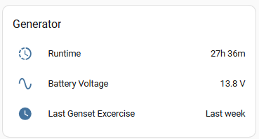
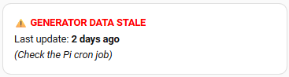
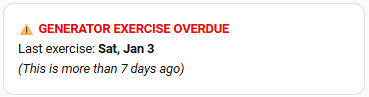

# Cummins Connect Cloud to Home Assistant Integration

## Preface

I set out to do an integration with REST calls and Python ```requests```. I had a WireShark capture as I logged into Cummins Connect Cloud and queried my generator's dashboard. Wow! The number of calls, redirects, and technology used from AWS, Salesforce and Microsoft proved to be too daunting. I settled on Selenium.

## Acknowledgement

I had never used Selenium before this undertaking. I still don't know what "Shadow DOM" stands for let alone what it is. Full credit goes to Google's AI assistant, ```Gemini```, for the success of this integration. It was Gemini that eventually suggested Selenium after seeing the complexity of the REST interaction.

## Disclaimer

Because I'm scraping data from the Cummins Cloud Connect portal, this tool may break if the website layout changes. The tool is unofficial: I make no commitment to make it work if Cummins changes their website.

## Dashboard View

Here is a snippet of my dashboard for what I report for my generator.



I want to know the runtime hours so I can schedule maintenance. I want to watch the battery voltage: the battery starts the generator. The last thing I want is a power outage and no operational generator because of a dead battery. And I want to check that the weekly genset exercise completed.

## System Overview

I used a Raspberry Pi 4 Model B to run a pipeline that collects the generator data of interest, formats a JSON string, and sends the string via an MQTT topic to Home Assistant. I used Selenium because it works satisfactorily on the Raspberry Pi 4 (I started with ```Playwright``` but had problems installing it).
The pipeline relies on two Python scripts:
1. ```ccc10_headless.py``` connects to Cummins Cloud Connect with my credentials, scrapes the generator data, and formats a JSON string.
2. ```send_to_ha.py``` gets command line arguments, establishes communication with the broker, gets the JSON string from stdio, and forwards the string to the specified topic.

A cron job runs nightly to trigger the pipeline.

```
Scraper (Selenium/Shadow DOM) -> JSON -> MQTT Sender (Paho) -> Home Assistant
```

## Prerequisites

You'll need an additional driver and additional Python packages.

To install the driver:
```bash
sudo apt install chromium-chromedriver
```

To install the additional Python packages:
```bash
pip3 install requests python-dateutil python-dotenv selenium paho-mqtt
```
## Environment Variables

You'll need your Cummins Connect Cloud credentials for the Selenium scraper. The Paho MQTT uses CallbackAPIVersion.VERSION2 so you'll need a username and password to send the JSON string to Home Assistant. The pipeline relies on these credentials to reside in a ```.env``` file with the following environment variable names:

```
MY_USERNAME = "your email address"
MY_PASSWORD = "your Cummins Cloud Connect password"
HA_USERNAME = "generator"
HA_PASSWORD = "password for the generator user in HA"
```

## Generator Scraper

The Python script that scrapes generator data from Cummins Connect Cloud is ```ccc10_headless.py.``` The script takes no arguments. It logs to ```generator_scraper.log``` in the same directory where the Python script resides. I've left commented out in a couple of places logging of the new URL as the scraper moves between web pages. If you encounter problems, I suggest uncommenting these debug statements.

A successful scrape produces minimal log records. Here is an example set.
```log
2026-02-09 03:00:09,124 - INFO - Searching for the 'SIGN IN' element...
2026-02-09 03:00:09,330 - INFO - [0] Tag: span | Text: SIGN IN | Visible: True
2026-02-09 03:00:09,366 - INFO - Attempting to click: SIGN IN
2026-02-09 03:00:16,661 - INFO - SIGN IN button clicked.
2026-02-09 03:00:18,086 - INFO - Attempting to click: Login
2026-02-09 03:00:18,257 - INFO - Login button clicked
2026-02-09 03:00:31,263 - INFO - Generator runtime = 27.6 Hours
2026-02-09 03:00:33,130 - INFO - Battery voltage = 13.8
2026-02-09 03:00:34,669 - INFO - Success: Events tab clicked.
2026-02-09 03:00:34,842 - INFO - Verified date: Tue, Feb 3rd, 2026 3:08 PM
2026-02-09 03:00:34,843 - INFO - Successfully converted to ISO: 2026-02-03T15:08:00+00:00
2026-02-09 03:00:34,844 - INFO - Final JSON payload: {"generator":{"runtime_hours":27.6,"battery_voltage":13.8,"last_exercise_date":"2026-02-03T15:08:00+00:00","last_updated":"2026-02-09T03:00:34-05:00"}}
2026-02-09 03:00:34,845 - INFO - Scrape completed successfully and payload printed.
```

When it encounters an exception or error, the script saves a ```.png``` file of the screenshot Selenium was seeing at the time. Have a look at any screenshots to debug problems. The ```.png``` files are in the same folder at the Python script.

> Shadow DOM Note: XPath locators do not work for elements inside a Shadow DOM. The script uses a recursive JavaScript search as a workaround for this constraint.

> ChromeDriver Path Note: The Service path in the script must match your actual chromedriver location (e.g., /usr/bin/chromedriver vs. /usr/local/bin/chromedriver). If you've installed to a different location from where I installed, adjust this line accordingly:
```python
    service = Service("/usr/lib/chromium-browser/chromedriver")
```

## Sending Generator Data to Home Assistant

The Python script ```send_to_ha.py``` sends the JSON string from the generator scraper script to Home Assistant. The script takes two mandatory and one option parameter.

```bash
>:~ $ python3 send_to_ha.py --help
usage: send_to_ha.py [-h] [-p PORT] broker topic

MQTT Pipeline Script for Cummins Generator Data

positional arguments:
  broker           The IP address of the MQTT broker (xxx.xxx.xxx.xxx)
  topic            The MQTT topic string (e.g., 'home/generator')

options:
  -h, --help       show this help message and exit
  -p, --port PORT  MQTT broker port (default: 1883)
```

The script is generic enough that you can use it to send data unrelated to your Cummins generator to Home Assistant. To tie everything together though I mentioned Cummins generator data in the script's description. And the script logs to ```generator_scraper.log``` for this same reason.

Here is an example set of log records for a successful relay of the JSON generator data onto Home Assistant.
```log
2026-02-09 03:00:35,156 - INFO - Payload: {"generator": {"runtime_hours": 27.6, "battery_voltage": 13.8, "last_exercise_date": "2026-02-03T15:08:00+00:00", "last_updated": "2026-02-09T03:00:34-05:00"}}
2026-02-09 03:00:35,156 - INFO - Connecting to broker: 192.168.2.83
2026-02-09 03:00:35,172 - INFO - Connected successfully!
2026-02-09 03:00:36,167 - INFO - Publishing to generator
2026-02-09 03:00:36,169 - INFO - Message Published (mid=1)
2026-02-09 03:00:36,169 - INFO - Publish confirmed by broker.
2026-02-09 03:00:36,170 - INFO - Cleaning up MQTT connection...
2026-02-09 03:00:37,171 - INFO - Done
```

The Python script uses Paho MQTT with a quality of service of 1: the script waits for confirmation by the Home Assistant broker that it published the message.

## Testing

Testing ```ccc10_headless.py``` requires a running the script from a terminal on the Raspberry Pi. With a successful run, you can cut-and-paste the audit record (Final JSON payload) into a file. For this example, assume it's ```test_str.``` 

To test MQTT publishing, you can concatenate ```test_str``` to a pipe to ```send_to_ha.py.```

```bash
cat test_str | python3 send_to_ha.py 192.168.2.83 "home/generator"
```

You can edit the timestamps ```test_str``` to validate conditional cards if you chose to add them to your Home Assistant instance. More on that next.

## Home Assistant

How you display your generator data is a personal choice. For these notes, I created a simple entities card. Here's the configuration in the visual editor.

```yaml
cards:
  - type: entities
    entities:
      - entity: sensor.generator_runtime_2
        name: Runtime
      - entity: sensor.generator_battery_voltage
        name: Battery Voltage
      - entity: sensor.generator_last_exercise
        name: Last Genset Excercise
    title: Generator
    card_mod:
      style: |
        .card-header {
          font-size: 18px;
        }
```
The generator card is in a ```vertical-stack.```

As noted, I have two conditional cards. One card lets me know if the pipeline fails. I run the pipeline daily from a ```cron``` job.

```
00 3 * * * wareed PYTHONPATH=/home/wareed/.local/lib/python3.14/site-packages /usr/local/bin/python3.14 -u /home/wareed/ccc10_headless.py 2>&1 | tee /home/wareed/headless.log | grep '^{"generator"' | /usr/local/bin/python3.14 /home/wareed/send_to_ha.py 192.168.2.83 "home/generator"
```
> Use of ```grep``` in crontab note: Because I use ```2>&1``` in the cron job, log messages feed into the pipe. The 
```grep '^{"generator"'``` command in the crontab is essential so that ```send_to_ha.py``` doesn't try to parse info logs as JSON.


If the ```last_updated``` date grow to 25 hours or more, Home Assistant lets me know that the pipeline failed.



Changing the ```last_updated``` value in ```test_str``` to a date at least 25 hours previously and sending this adjusted JSON string to Home Assistant lets you test that you can see the conditional card.

If the last generator's last exercise date is more than a week ago, Home Assistant lets me know that the generator has missed an  automatic, self-diagnostic test run.



You can set the ```last_exercise_date``` value back by one month in ```test_str``` and send the JSON string to Home Assistant to verify that it produces the conditional card.

## Home Assistant Configuration YAML

Here for reference is how I have the sensors and templates configured in my ```configuration.yaml``` file.

```yaml
mqtt:
  sensor:
     - name: "Generator Runtime"
      state_topic: "generator"
      unique_id: "generator_runtime_001"
      value_template: "{{ value_json.generator.runtime_hours | float(0) }}"
      unit_of_measurement: "h"
      device_class: duration
      state_class: total_increasing

    - name: "Generator Battery Voltage"
      state_topic: "generator"
      unique_id: "generator_battery_001"
      value_template: "{{ value_json.generator.battery_voltage | float(0) }}"
      unit_of_measurement: "V"
      device_class: voltage
      state_class: measurement

    - name: "Generator Last Exercise"
      state_topic: "generator"
      unique_id: "generator_last_exercise_001"
      value_template: "{{ value_json.generator.last_exercise_date }}"
      device_class: timestamp      

    - name: "Generator Last Updated"
      state_topic: "generator"
      unique_id: "cummins_gen_last_upd"
      value_template: "{{ value_json.generator.last_updated }}"
      device_class: timestamp

template:
  - binary_sensor:
      - name: "Generator Data Freshness"
        unique_id: "gen_data_freshness_check"
        device_class: problem
        state: >
          
          
            true
          
            {{ (now() - last_run) > timedelta(hours=25) }}
          
        icon: >
          {{ 'mdi:database-alert' if is_state('binary_sensor.generator_data_freshness', 'on') else 'mdi:database-check' }}
      - name: "Generator Exercise Status"
        unique_id: "gen_exercise_status_check"
        device_class: problem
        state: >
          
          
            false
          
            {{ (now() - last_ex) > timedelta(days=8) }}
          
```

## Collaboration

If you encounter a new CSS selector or a change in the Cummins portal, please feel free to open an Issue or a Pull Request.

## Final Word


I had an interesting time trying to cobble a solution with Python ```requests```. Google's AI assistant Gemini helped me to get so far and then stonewalled me. I asked Gemini why. You can read about it here: ```https://www.wareed.ca/blog/an-ai-stonewall```

